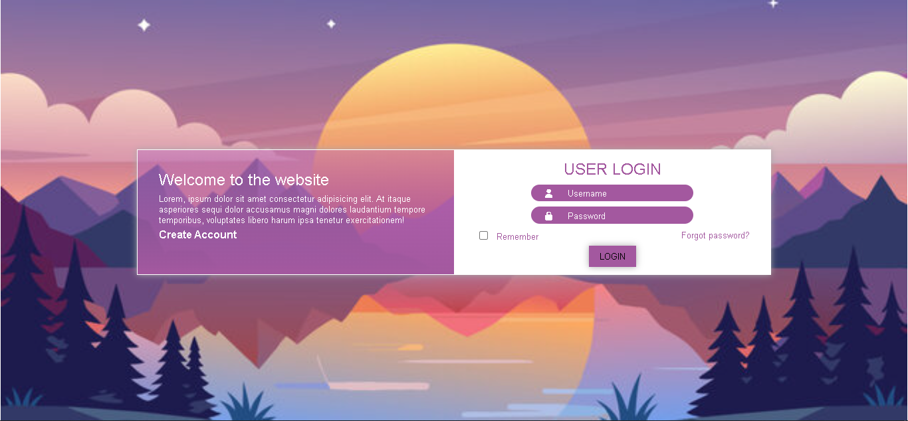

# Login Page

A simple yet visually appealing login page created using HTML and CSS. This project demonstrates how to design a user-friendly and responsive login interface with a background image.

## Project Structure

- `index.html`: The main HTML file containing the structure of the login page.
- `style.css`: The CSS file containing styles for layout, responsiveness, and animations.
- `bg.jpg`: The background image for the login page.

## How to View the Website

You can view this login page by simply opening the `index.html` file in any web browser. Make sure to link the `style.css` file and the background image `bg.jpg` correctly in the same directory.

## Technologies Used

- **HTML**: For creating the structure of the login page.
- **CSS**: For styling the login form and making the layout responsive.
- **FontAwesome**: For the icons used in the form fields (user and password).
  
## Features

- Two-panel layout with a **Welcome Message** on the left and a **Login Form** on the right.
- Beautiful sunset-themed background image.
- Interactive elements like the **Login** button and **Remember Me** checkbox.
- Icons in the form fields for username and password inputs.
- Hover effect on the login button for improved user experience.

## Future Improvements

- Add validation to the username and password fields.
- Integrate this login page with a backend system to handle user authentication.
- Enhance responsiveness for smaller screens.
  
## Feedback and Support

Feel free to provide feedback or report issues by opening an issue on this repository. Any suggestions or improvements are welcome!

## Stay Tuned

I plan to enhance this project by adding more functionality and design improvements. Stay tuned for updates!
